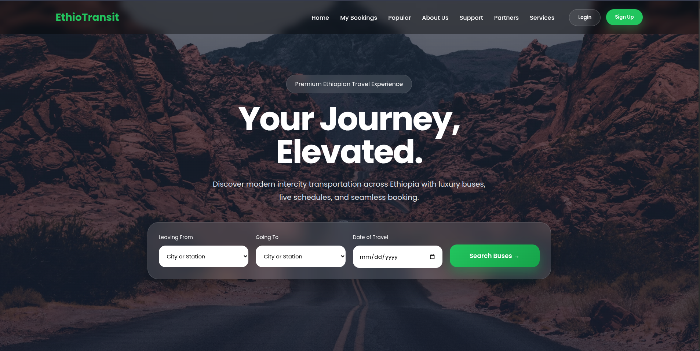
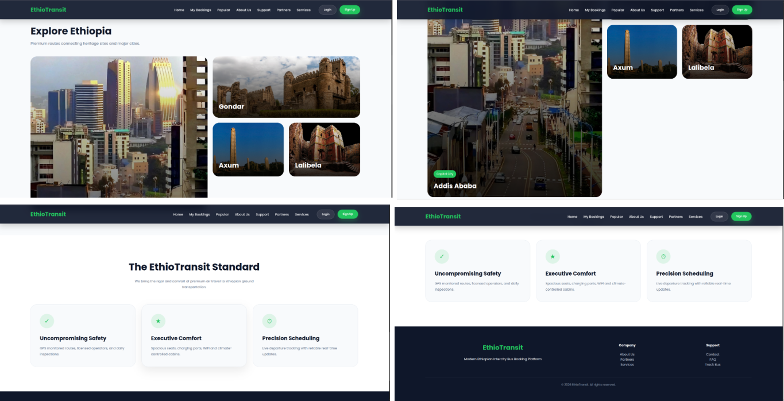
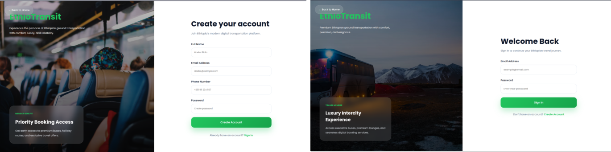
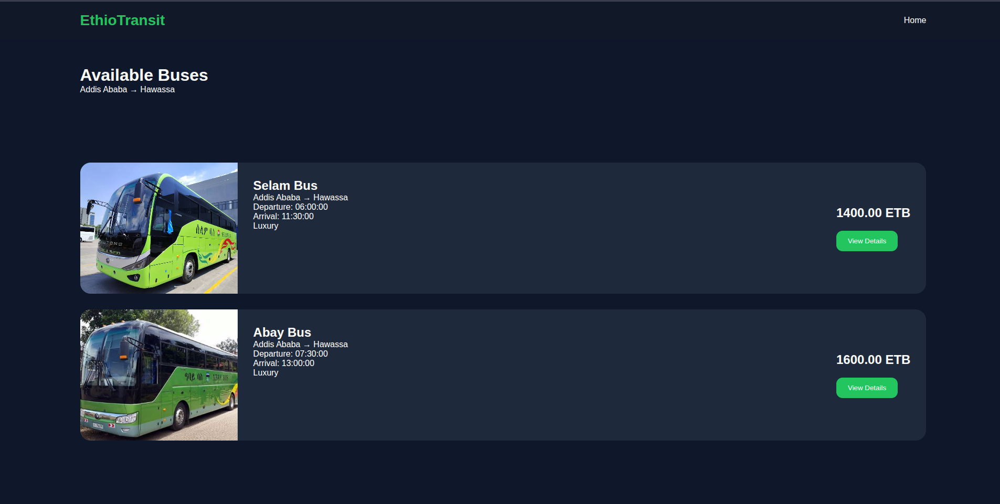
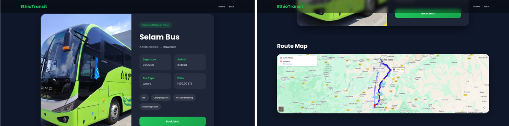
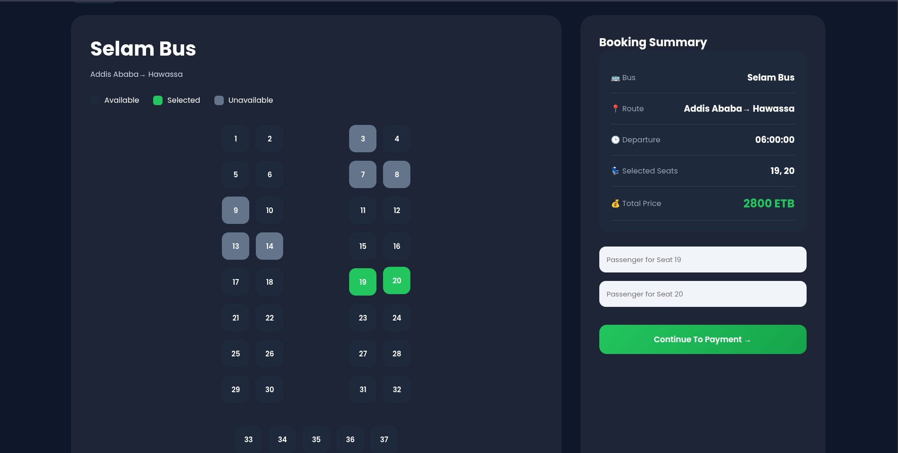
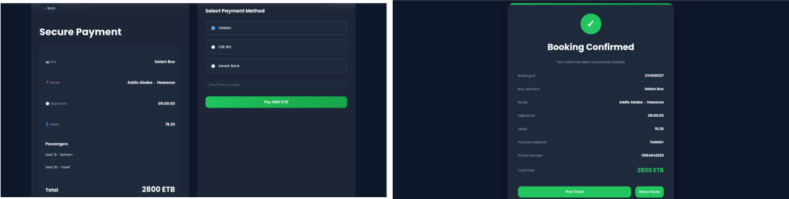
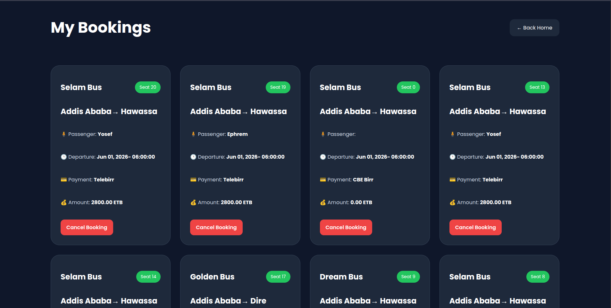
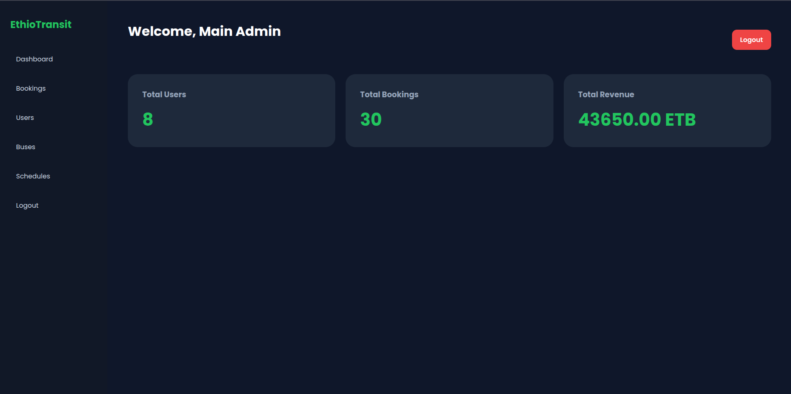

## 🚍 EthioTransit

<p align="center">
  <strong>A Modern Bus Ticket Booking & Management System for Ethiopia</strong>
</p>

<p align="center">
  Built with PHP, MySQL, JavaScript, HTML & CSS
</p>

---

## 🌟 Overview

EthioTransit is a web-based platform designed to simplify bus ticket booking and transportation management.

Passengers can search routes, reserve seats, manage bookings, and complete payments through an intuitive interface, while administrators can efficiently manage buses, schedules, users, and reservations from a dedicated dashboard.

---

## ✨ Features

### 👤 Passenger Features

* 🔐 User Registration & Login
* 🔎 Search Available Routes
* 🚌 View Bus Details
* 💺 Seat Selection & Reservation
* 💳 Payment Processing
* 📋 Booking Management
* ✅ Booking Confirmation

### 🛠️ Administrator Features

* 🔑 Secure Admin Login
* 🚌 Bus Management
* 📅 Schedule Management
* 👥 User Management
* 🎫 Booking Management
* 📊 Administrative Dashboard

---

## 🛠️ Technology Stack

<p align="center">


</p>

---

## 📂 Project Structure

```text
EthioTransit
│
├── admin/          # Admin dashboard and management tools
├── config/         # Database configuration
├── css/            # Styling files
├── images/         # Images and assets
├── js/             # JavaScript functionality
├── php/            # Backend helper scripts
│
├── index.php
├── login.php
├── register.php
├── booking.php
├── payment.php
└── ...
```

---

## 🚀 Getting Started

### Clone the Repository

```bash
git clone https://github.com/Ephrem7Y/EthioTransit.git
```

### Move to Web Server Directory

```bash
sudo mv EthioTransit /var/www/html/
```

### Configure Database

Edit:

```text
config/database.php
```

and

```text
php/db.php
```

with your MySQL credentials.

### Run the Application

Start Apache and MySQL, then visit:

```text
http://localhost/EthioTransit
```

---

## 📸 Screenshots

### 🏠 Home Page




### 👤 Login | SignUp Page



### 🔎 Route Search



### 🚌 Bus Details



### 💺 Seat Booking



### 📊 Payment Dashboard



### 📝 My Bookings



### 🛠️ Admin Dashboard



---

## 🎓 What I Learned

Through this project, I gained practical experience with:

* Full-stack web development
* Authentication systems
* Session management
* CRUD operations
* Relational database design
* PHP & MySQL integration
* Software project organization
* Git & GitHub workflows

---

## 👨‍💻 Author

### Ephrem Yosef

💻 Frontend & Backend Developer
🎓 Computer Science Student
🎮 Game Development Enthusiast

---

<p align="center">
  Built with ❤️, curiosity, and lots of debugging.
</p>
